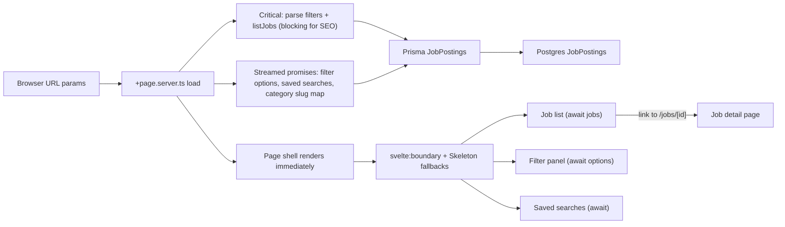
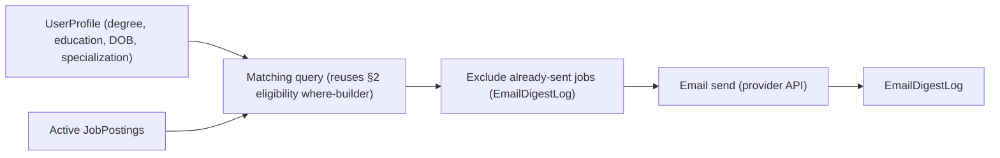

# Pakistan Government Jobs Portal

## Context

The repo is already a **SvelteKit 2 + Svelte 5** app with **shadcn-svelte** (vega/neutral) and **Prisma 7** pointed at Supabase Postgres. Feature UI does not exist yet — only the default welcome page.

**Data source:** Prisma model [`JobPostings`](prisma/schema.prisma) (`row_id` PK). Ignore the parallel `JobPosting` / `jobs` models for this build; query only `JobPostings`.

**Core purpose of this portal:** let a user filter down to jobs they're actually eligible for based on their own background. The four fields that matter most — and should get top billing in both the query layer and the UI — are:
- **`degree_areas`** (and possibly a related `degree`/`degrees` column — confirm exact column names during the real-data check below) — the degree/subject area(s) a posting requires. **Confirmed: these hold multiple values separated by commas in a single string column** (not a Postgres array) — this resolves the array-vs-string question flagged earlier in this plan; build the where-clause and display logic around comma-delimited string values (see §2, §3, §4).
- **Qualification / education level** (`education_level` and/or a separate `qualification_level` column if the schema has one — confirm which columns actually exist and how they relate; they may be the same field or two related-but-distinct ones, e.g. "Bachelor's" vs. "BS Computer Science").
- **`grade`** — the pay/service grade of the post (e.g. BPS grade), often what an experienced applicant searches by directly.
- **Age limit** (`max_age`, possibly a `min_age` too — check for a lower bound as well; a real eligibility check needs both, not just a ceiling).

Everything else (posting place, domicile, department, keyword search) is secondary — useful for narrowing, but not what makes the portal actually work for its main purpose of self-eligibility screening.

**Before writing code**, inspect real rows for `degree_areas`/`degree` (comma-delimited, confirmed — check whether there are separator inconsistencies like `", "` vs `","` vs stray `"and"` that need normalizing), `education_level`/`qualification_level`, `grade`, `max_age`/`min_age`, `place_of_posting`, `domicile` to confirm exact column names, Prisma types for the non-degree fields (string vs. array vs. enum-like), delimiter conventions where relevant, and casing inconsistencies (e.g. "Lahore" vs "lahore"). The filter logic and dropdown/badge-normalization approach both depend on this — don't assume based on column name alone for the fields not yet confirmed.

## Architecture



Filters live in the URL (`?degree_areas=&education_level=&qualification_level=&grade=&min_age=&max_age=&place_of_posting=&domicile=&q=&sort=&page=`), with the eligibility fields (`degree_areas`, `education_level`/`qualification_level`, `grade`, age) as the primary, most prominent set. Changing a filter updates the query string and reloads via SvelteKit — shareable, bookmarkable, no client-only state. **Do not block the entire page on every independent fetch** — return unresolved promises from `load` for non-critical data and render each section inside its own `<svelte:boundary>` with a skeleton `pending` snippet (Svelte's Suspense equivalent). On client-side navigation, also use `$app/state`'s `navigating` to show skeletons immediately while the new `load` runs, so slow networks see feedback before streamed chunks arrive. A separate, curated tier of clean-URL category pages (`/engineering-jobs`, `/bs-cs`, `/mba`) sits alongside this for SEO — see §20; they reuse the same underlying query logic with a preset filter, not a different code path.

## 0. Environment & setup (do first)

- Confirm `DATABASE_URL` (and any direct/pooled connection variants Supabase provides) is present in `.env` / `.env.example`; document required vars in README.
- Note connection pool sizing: Supabase's pooler has connection limits — use the pooled connection string for the app, not the direct one, and keep the `pg` Pool `max` conservative (e.g. 5–10) since serverless/edge deploys can multiply connections.
- Decide and record the deploy target (Node adapter vs. edge/serverless) early, since it affects Prisma driver adapter config and pool sizing.

## 1. Fix scaffolding so UI and DB actually work

- Register `@tailwindcss/vite` in [`vite.config.ts`](vite.config.ts) (installed but unused).
- Import [`src/app.css`](src/app.css) in [`src/routes/+layout.svelte`](src/routes/+layout.svelte).
- Wire Prisma v7 correctly in [`src/lib/server/db.ts`](src/lib/server/db.ts): use `@prisma/adapter-pg` + `pg` Pool with `DATABASE_URL`, then `new PrismaClient({ adapter })`. Export a single module-level instance (avoid re-instantiating the Pool per request in dev with HMR — guard with a global cache, the standard SvelteKit/Prisma pattern).
- Run `prisma generate` so the client matches the schema.
- Add a site shell in `+layout.svelte`: simple header with brand name (e.g. "Sarkari Nokri" / project name), main content area, and a light/dark mode toggle button (see §9) — neat, minimal, matching existing Inter + shadcn tokens.
- Add a root `+error.svelte` (or rely on SvelteKit default) so a DB outage or thrown error renders a readable page instead of a raw stack trace.

## 2. Server-side jobs query layer

Add [`src/lib/server/jobs.ts`](src/lib/server/jobs.ts):

- `parseJobFilters(url)` — read and sanitize search params. Validate/coerce types defensively: `page`, `min_age`/`max_age` must parse to positive integers (fall back to defaults, don't throw, on garbage input like `?page=abc`); `degree_areas` accepts multiple values (`?degree_areas=Computer%20Science&degree_areas=IT` or a comma-separated single param — pick one convention and document it) since a person often qualifies under more than one degree area; cap `page`/`pageSize` to sane bounds to avoid huge `skip` values.
- `buildJobWhere(filters)` — Prisma `where`, **eligibility fields first, as the primary filter logic**:
  - **`degree_areas`** (the headline filter, confirmed comma-delimited string — see Context): case-insensitive `contains` per selected value, OR'd together — a job matches if its `degree_areas` string contains *any* of the values the user selected. Apply the same logic to `degree`/`degrees` if that turns out to be a distinct column.
  - **`splitMultiValue(rawString): string[]`** — a small shared helper (also used for display, see §3/§4): split on `,`, trim whitespace from each piece, drop empty strings, de-duplicate case-insensitively. Every place that reads `degree_areas` (filter building, dropdown options, badge rendering) goes through this one function so parsing stays consistent instead of three slightly-different implementations drifting apart.
  - **`education_level` / `qualification_level`**: case-insensitive `contains` or exact match depending on whether the column holds free text ("Bachelor's degree in...") or a controlled set of levels (Matric/Intermediate/Bachelor's/Master's/etc.) — a controlled set should use exact match against a dropdown, which is more precise and worth confirming during the data check, since it directly affects how reliable eligibility filtering feels to the user.
  - **`grade`**: exact match (or a min/max range if grades are numeric, e.g. BPS-16 and up) against a Select populated from distinct values — grade is typically a small, well-defined set so this should be simple and precise, not a fuzzy `contains`.
  - **Age**: two-sided check — job's `min_age` (if present) `<= userAge` **and** job's `max_age >= userAge` **or** the respective bound is null (unbounded on that side). Don't only check the ceiling; a posting with a real minimum age would otherwise be shown to someone too young for it.
  - `place_of_posting`, `domicile` (secondary): case-insensitive `contains` (covers comma/space-separated stored values, pending the real-data check in Context above).
  - Text `q` (secondary): `OR` on `title` / `department` / `description` with `contains` + `mode: 'insensitive'`.
  - `active: true` when `active` is not null (skip inactive rows).
  - `last_date` / closing date: by default exclude postings whose apply deadline has already passed; add a `?show_expired=1` escape hatch so closed jobs are still reachable (useful for archive/reference browsing) rather than silently disappearing.
  - Optional extras that fit the same UI without scope creep: `department`, `province`.
- `listJobs({ filters, page, pageSize })` — `findMany` + `count`, default order by `ad_date` desc then `row_id` desc; support a `sort` param (`newest`, `closing_soon`) since "closing soon" is a common real-world need for a jobs board. Paginate (default 20, hard cap e.g. 100).
- `getJobById(row_id)` — single row for detail; return `null` (not throw) on missing/invalid id so the route can 404 cleanly.
- `getFilterOptions()` — distinct-ish option lists for selects, **with `degree_areas`, `education_level`/`qualification_level`, and `grade` populated first/prioritized** since those drive the primary filters. Because some values are free-text strings, load recent active rows (or raw SQL `DISTINCT`) and normalize/split `degree_areas`/`degree` through `splitMultiValue()` (see above); trim, de-dupe case-insensitively, and cap each list's length (e.g. top 50 by frequency) so a Select doesn't get 500 near-duplicate options — `grade` and controlled-vocabulary `education_level` should naturally stay small without needing a cap. **Cache this in-memory with a short TTL (e.g. 5 min)** — it's a full-table-ish scan; return it as a **streamed promise from `load`** (§3) so it never blocks the job list. Same for a small `getCategorySlugMap()` helper (cached) used by clickable badges.

## 3. Home page: job list + filters

Replace welcome content with the portal home:

| File | Role |
|------|------|
| [`src/routes/+page.server.ts`](src/routes/+page.server.ts) | `load`: parse filters (sync) + **await only critical job list/count**; return filter options, saved searches, and category slug map as **unresolved promises** (streamed) |
| [`src/routes/+page.svelte`](src/routes/+page.svelte) | Page shell + `<svelte:boundary>` sections for jobs, filters, saved searches |
| [`src/lib/components/jobs/job-list.svelte`](src/lib/components/jobs/job-list.svelte) | Job cards + pagination; receives awaited `jobs`/`total`; parent shows `JobListSkeleton` when `navigating` |
| [`src/lib/components/jobs/filter-panel.svelte`](src/lib/components/jobs/filter-panel.svelte) | Eligibility + secondary filters; `{#await data.options}` or boundary around option-dependent selects |
| [`src/lib/components/jobs/job-list-skeleton.svelte`](src/lib/components/jobs/job-list-skeleton.svelte) | Skeleton cards matching real card layout (title, badges, metadata rows) |
| [`src/lib/components/jobs/filter-panel-skeleton.svelte`](src/lib/components/jobs/filter-panel-skeleton.svelte) | Skeleton selects/inputs matching filter panel structure |

**Progressive loading strategy (required — not optional polish):**

SvelteKit is not React, but the same UX goal applies: **show layout immediately, load sections independently, skeleton until each resolves**. Use SvelteKit streaming + `<svelte:boundary>` (Suspense-style boundaries with a `pending` snippet) + shadcn `Skeleton` — not a single `Promise.all` that waits for jobs, filter options, and saved searches before anything renders.

| Data | Priority | Load behavior | UI behavior |
|------|----------|---------------|-------------|
| Parsed `filters` from URL | Critical | Return synchronously (no DB) | Filter inputs show current URL state immediately |
| `listJobs` (jobs + total + totalPages) | Critical for SEO + core UX | **Await in `load`** so crawlers and first paint get real job HTML | Wrap in `<svelte:boundary>`; on **client navigation**, show `JobListSkeleton` via `navigating` *or* boundary `pending` until jobs resolve |
| `getFilterOptions()` | Non-critical | Return as **streamed promise** — do **not** `await` alongside `listJobs` | `<svelte:boundary pending={filterPanelSkeleton}>` around filter selects; URL-driven text/number inputs still work while options load |
| `listSavedSearches()` | Non-critical | Return as **streamed promise** | Boundary + compact skeleton for saved-search chips/dropdown |
| Category slug ↔ filter map (§20 badges) | Non-critical | Return as **streamed promise** (cached lookup) | Badge links render once map resolves; show plain non-linked badges until then |
| `logSearch()` (§12) | Fire-and-forget | Never `await` in `load` | No UI |

**Example `load` shape (pattern — adapt to actual types):**

```ts
export const load = async ({ url, locals }) => {
  const filters = parseJobFilters(url);

  const jobs = listJobs(filters); // start immediately
  const options = getFilterOptions(); // streamed — don't await here
  const savedSearches = locals.visitorId
    ? listSavedSearches(locals.visitorId).catch(() => [])
    : Promise.resolve([]);
  const categoryLinks = getCategorySlugMap(); // streamed, cached

  const result = await jobs; // only block on what SEO and the main column need
  if (filtersAreActive(filters)) {
    logSearch(filters, result.total, locals.visitorId); // fire-and-forget
  }

  return {
    filters: { /* serializable snapshot */ },
    jobs: result.jobs,
    total: result.total,
    totalPages: result.totalPages,
    options,           // Promise — streamed to client
    savedSearches,     // Promise — streamed
    categoryLinks,     // Promise — streamed
    filtered: filtersAreActive(filters),
    canSave: eligibilityFiltersActive(filters)
  };
};
```

**Anti-pattern to remove:** `await Promise.all([listJobs, getFilterOptions, listSavedSearches])` — this forces the slowest query to gate the entire page. Independent fetches must not block each other.

**Navigation feedback:** On filter/pagination navigations, check `$app/state`'s `navigating` (or `$app/stores` `navigating` if that's what the installed Kit version exposes) and swap the job list to `JobListSkeleton` while the navigation is in flight — skeletons should appear **on click**, not only after the server responds.

**UI (shadcn):**

- Install shadcn `skeleton` if not present — base primitive for all loading states.
- **Filters, split into two visual tiers** (desktop: left column; mobile: Dialog/Sheet):
  - **Primary — "Find jobs matching your background"** (visually grouped, larger/first, maybe its own card with a distinct heading): multi-select for `degree_areas` (a person often qualifies under more than one — a single-value Select undersells the feature), Select for `education_level`/`qualification_level`, Select for `grade`, number Inputs for min/max age (or a single age input compared against both bounds — simpler UI, same underlying two-sided check from §2). This block is the reason the portal exists; it should not be visually equal to or buried under the secondary filters.
  - **Secondary — refine further**: Select/Input for place of posting, domicile; text Input for keyword search; sort Select (newest / closing soon). Can be visually subordinate (smaller heading, or collapsed under "More filters" on mobile) since these narrow rather than define eligibility.
  - Clear + Apply for the whole panel. Apply can be "on change" via `goto` with `invalidateAll` / `data-sveltekit-replacestate`; debounce the keyword `q` input (e.g. 300ms) so typing doesn't fire a navigation per keystroke.
- **Results:** list of compact job rows/cards (Card + Badge) showing title, department, education level, degree area(s), grade, place of posting, domicile, age limit, last date to apply — i.e. the eligibility fields get equal or greater prominence than posting/domicile in the card, not an afterthought. Visually flag jobs closing within a few days (e.g. a Badge variant) and dim/mark expired ones when `show_expired=1` is active. Link each row to detail.
- **Comma-separated eligibility values render as individual, clickable Badges — not one run-on string.** `degree_areas`/`degree` (and any other multi-value field) get split via `splitMultiValue()` (§2) and each piece rendered as its own `Badge`, e.g. "Computer Science" and "Information Technology" as two separate chips rather than "Computer Science, Information Technology" as unbroken text. Same treatment applies wherever these fields are shown — job cards here, and the detail-page eligibility block in §4.
  - **Clicking a badge filters by that single value.** Each badge is a real `<a href="...">` (not a JS-only `onclick`), so it works without JS, is crawlable, and gets standard link styling/keyboard focus for free. Give clickable eligibility badges a distinct visual treatment (e.g. underline-on-hover or an outline variant) from purely informational badges (like the "closing soon" status flag in the same card) so it's visually obvious which chips are interactive.
  - **Link target**: if the clicked value matches an existing `CategoryPage` slug (§20) — e.g. clicking "Computer Science" when `/bs-cs` exists and is defined as exactly that filter — link there directly, since it's the cleaner, SEO-indexed URL. Otherwise, fall back to the query-string filtered home view (`/?degree_areas=Computer%20Science`), which still works but is `noindex`ed per §20. This means the `CategoryPage` lookup needs to be available wherever cards are rendered (pass it down from `load`, or a small cached slug↔filter map) rather than re-querying per badge.
  - **Filter reset on click**: clicking a badge sets `degree_areas` to just that one value and clears the other filters (grade, education level, age, location, keyword) rather than adding to whatever's currently applied — the intent of clicking "Computer Science" on a job card is "show me all Computer Science jobs," not "add this on top of my current filter soup." Preserve `sort` if the person had one set, since that's a display preference rather than a filter.

**Empty / loading / error states etc.:**
- **Skeletons, not spinners or plain "Loading…" text** — match the real component geometry (card height, badge rows, select widths) so layout doesn't jump when data arrives. Reuse the same Card/Badge spacing tokens from §9.
- Empty state when zero matches (with a "clear filters" affordance — especially important here, since a too-narrow combination of degree/education/grade/age is the most likely way to zero out results); show skeletons during navigation and streamed loading, then swap to empty or populated state per section.
- If the **jobs** query fails (DB error), show a friendly retry message in the job-list boundary rather than letting it bubble to a blank page; streamed sections (`options`, `savedSearches`) can fail independently with inline retry affordances without taking down the job list.
- **Pagination:** page links preserving current filter params; disable/hide next when on the last page; show total result count once `jobs` resolves (skeleton placeholder for "N results" text while loading).

Install any missing shadcn pieces as needed (`skeleton`, `label`, `sheet` or reuse existing `dialog`, `checkbox` only if useful). Prefer already-present `button`, `input`, `select`, `badge`, `card`, `separator`.

## 4. Job detail page

- [`src/routes/jobs/[id]/+page.server.ts`](src/routes/jobs/[id]/+page.server.ts) — **await** `getJobById(row_id)` (blocking — detail content is the whole page and must SSR for SEO); return `categoryLinks` as a **streamed promise** for clickable degree badges; `error(404)` if missing or if `row_id` doesn't parse as a valid id (don't let a non-numeric param 500).
- [`src/routes/jobs/[id]/+page.svelte`](src/routes/jobs/[id]/+page.svelte) — single-column detail. Core fields (title, eligibility block, apply links) render from awaited job data immediately. Wrap only the **category-link badge resolution** in `<svelte:boundary pending={badgeSkeleton}>` if the slug map is streamed — badges show as plain text chips until the map resolves, then become links without shifting layout.
- **Detail skeleton (client navigation only):** add [`src/lib/components/jobs/job-detail-skeleton.svelte`](src/lib/components/jobs/job-detail-skeleton.svelte) — title bar, eligibility definition-list rows, apply-button placeholders — shown when `navigating` targets a detail route. Do not skeleton the entire detail page on SSR first visit; crawlers need real HTML.
- Single-column detail with an **"Eligibility" block given its own clear section**, not buried in prose: education/qualification level, degree area(s), grade, age range (min–max), domicile, and place of posting — this is the block someone lands on to answer "do I actually qualify?", so it should be scannable (labeled rows or a small definition list), not a paragraph. **Degree/degree-area values use the same split-into-clickable-badges treatment as §3** — each comma-separated value its own linked Badge, following the same category-page-or-query-string target logic. Below/alongside it: title, department, vacancies/employment type, last date, apply links (`url`, `application_online_address`, `email`), and description/notes when present. Show a clear "Applications closed" notice if `last_date` has passed, instead of presenting an expired posting as open. Back link to filtered home is nice-to-have via `document.referrer` or a simple "All jobs" link.

## 5. Filtering semantics (concrete)

| Param | Priority | Prisma condition |
|-------|----------|------------------|
| `degree_areas` | **primary** | `contains` per comma-split value (see `splitMultiValue`, §2), OR'd together |
| `education_level` / `qualification_level` | **primary** | exact match if controlled vocabulary, else `contains` (confirm during data check) |
| `grade` | **primary** | exact match against distinct values (or numeric range if applicable) |
| `min_age`/`max_age` (user's age) | **primary** | job's `min_age <= N` (or null) **and** job's `max_age >= N` (or null) |
| `place_of_posting` | secondary | `place_of_posting` contains value |
| `domicile` | secondary | `domicile` contains value |
| `q` | secondary | title/department/description contains |
| `show_expired` | filter | when absent, `last_date >= today` OR `last_date` is null |
| `sort` | display | `newest` → `ad_date desc`; `closing_soon` → `last_date asc nulls last` |
| `page` | display | skip/take, bounded |

## 6. Performance & data integrity

- Verify/add Postgres indexes on columns used for filtering and sorting, **prioritizing the eligibility fields since they're the primary/most-used filters**: `active`, `ad_date`, `last_date`, `grade`, `education_level`/`qualification_level`, `min_age`/`max_age` (plain btree — these are the highest-traffic filters and cheapest to index well since they're low-cardinality or numeric). For `degree_areas`/`degree` (confirmed comma-delimited strings): a trigram (`pg_trgm`) index to keep `contains` fast as the table grows. Same trigram approach for `place_of_posting`/`domicile` as secondary filters.
- Since filters use `contains`, keep an eye on query plans once there's realistic data volume — case-insensitive `contains` on unindexed text columns can get slow; `pg_trgm` GIN indexes are the usual fix if needed.
- `getFilterOptions()` caching (see §2) is the main defense against repeated expensive scans; **streaming it separately from `listJobs`** (§3) ensures cache warmth never delays first paint of job results. Revisit if either query still shows up as a hotspot.

## 7. Accessibility

- Every filter control has an associated `<label>` (shadcn `Label`), including in the mobile Sheet.
- Mobile filter Dialog/Sheet is keyboard-dismissible and traps focus appropriately (shadcn defaults should cover this — verify, don't assume).
- Maintain WCAG AA contrast (≥4.5:1 for body text, ≥3:1 for large text/UI components) for every color pairing defined in §9 — check this when the palette is chosen, not after.
- Semantic landmarks (`<header>`, `<main>`, `<nav>` for pagination) and heading hierarchy (`h1` per page, `h2` for sections) so the DOM structure itself is navigable, which also feeds directly into SEO.
- Clickable eligibility badges (§3/§4) are real anchor elements with descriptive accessible names (e.g. `aria-label="Filter by Computer Science"` if the visible badge text alone is ambiguous out of context) — a screen-reader user tabbing through a card full of badges needs to know each one is a filter link, not just repeated text.

## 8. SEO strategy

Government job listings are exactly the kind of content people search for by name ("PPSC junior clerk 2026", "FPSC jobs Lahore"), so SEO is worth doing properly rather than as an afterthought. See also §20 for how filtering itself is structured for SEO — curated category URLs (`/engineering-jobs`, `/bs-cs`) versus `noindex`ed query-string filter combinations — since that decision shapes several items below.

**Metadata (every page, via `<svelte:head>`):**
- Unique `<title>` per page — list: `"Government Jobs in Pakistan — <Brand>"`, filtered list: fold active filters in (e.g. `"Lahore Government Jobs — <Brand>"`), detail: `"<Job title> — <Department> — <Brand>"`.
- Unique meta `description` per page (~150–160 chars); for detail pages, generate from the posting's title/department/last date rather than truncating the raw description blob.
- `canonical` link tag: point filtered/paginated list views back to a clean canonical (e.g. strip `page`/`sort` or point `page > 1` to page 1) so filter-permutation URLs don't create duplicate-content issues.
- Open Graph + Twitter Card tags (`og:title`, `og:description`, `og:type=website`/`article`, `og:url`) so shared links render well.

**Structured data:**
- Add `JSON-LD` using schema.org's `JobPosting` type on each detail page — `title`, `description`, `datePosted`, `validThrough` (map to `last_date`), `hiringOrganization`, `jobLocation`, `employmentType` where the data supports it. This is what makes listings eligible for Google's job-search rich results, which is the single highest-leverage SEO move for this kind of site.
- Mark expired postings' `validThrough` accurately (see §2) — stale structured data for closed jobs actively hurts rather than just being neutral.

**Crawlability:**
- `robots.txt` allowing the list and detail routes; disallow nothing that matters for a public jobs board (no auth-gated content in this scope).
- Dynamic `sitemap.xml` (a `+server.ts` route) enumerating detail pages for active (or all, with `lastmod`) postings, **plus every indexed `CategoryPage` slug from §20**, regenerated/queried live rather than hand-maintained — sitemaps go stale fast on data-driven sites otherwise.
- Server-rendered content: since this is SvelteKit with server `load`, list/detail HTML is already crawlable without JS — **keep job list and detail body as awaited (blocking) data in `load`** so crawlers get full listings in the initial HTML. Streamed sections (filter dropdown options, saved searches, category slug map) are non-indexable UI chrome — safe to defer behind `<svelte:boundary>`. Don't regress SEO by moving the job query to client-side `fetch` or by putting the entire list behind a boundary `pending` snippet on SSR (that would ship skeleton HTML to crawlers instead of jobs).
- Human-readable, keyword-bearing URLs for detail pages if feasible (e.g. `/jobs/[id]-[slug]`) rather than a bare numeric id — improves both CTR in search results and clarity of shared links. If added, the `[id]` segment stays the source of truth for lookup; the slug is cosmetic and shouldn't 404 on mismatch.

**Content:**
- Real, descriptive `h1`/`h2` text (not just styled Badges) so crawlers and screen readers get the same eligibility info sighted mouse users do.
- Avoid thin/duplicate pages: an empty-filter-results page should still return a real page (with a clear "no matches" message) rather than a blank shell, and should not be indexed if genuinely empty (`noindex` on zero-result filtered views).

## 9. Visual design: color system & professional UI

Goal: a clean, trustworthy, government/civic-institutional feel — closer to a well-run public-sector site than a consumer app. Legible, calm, high information density done tidily; not flashy.

**Color system:**
- Define the palette as design tokens (CSS variables, consistent with the existing shadcn "neutral" base) rather than hard-coded hex values in components, so it's a single source of truth.
- Suggested direction: a neutral gray/slate base (already the shadcn "neutral" theme) + **one** confident primary accent — a deep blue or blue-green (e.g. in the `#1e3a5f`–`#0f4c81` range) reads as institutional/trustworthy and is a common, well-tested choice for civic/government-adjacent products. Avoid saturated, "startup-bright" primaries (hot pink, neon purple) — they undercut the trust signal this content needs.
- Status colors kept restrained and purpose-built, not decorative: a muted green for "open"/active, muted amber for "closing soon," muted red/gray for "closed/expired" — reuse shadcn's existing Badge variant tokens rather than inventing a new ad hoc set.
- Background: off-white/very light gray (not pure `#fff`) for the page, white cards on top, to create depth without needing heavy shadows.
- Confirm every text/background pairing hits WCAG AA (see §7) — run the palette through a contrast checker before locking it in, especially the accent-on-white and status-badge combinations.

**Light/dark mode (required, not optional):**
- Both themes are in scope, **light as the default** — a first-time visitor with no stored preference always lands on light mode, regardless of their OS `prefers-color-scheme`. Only respect the user's own toggle choice, not the system setting, as the ongoing source of truth once they've made one — this is a deliberate product decision (consistent branding on first visit) rather than the more common "follow system by default" pattern, so call it out explicitly in code comments/PR description so it isn't "fixed" to system-follow later by someone assuming that's the default best practice.
- Implement as a token-level theme, not a second parallel palette: the same CSS variables from the Color system above (`background`, `foreground`, `card`, accent, status colors) get a `.dark` variant with adjusted values — same accent hue, shifted lightness/saturation for dark backgrounds; status colors similarly darkened/desaturated rather than kept identical (a muted green that works on white can look wrong on near-black). Never hardcode a light-mode color in a component; everything goes through the token layer so the toggle "just works" everywhere at once.
- **Toggle placement**: a sun/moon icon button in the site header/top nav (from `+layout.svelte`'s header, §1), reachable on every page including mobile (in the mobile nav, not hidden behind a menu that requires extra taps) — `lucide-svelte`'s `Sun`/`Moon` icons are a natural fit alongside the existing shadcn iconography. Button needs an accessible label (`aria-label="Toggle dark mode"` or similar, since it's icon-only) per §7.
- **Persistence**: store the choice in a cookie (not `localStorage` — a cookie is readable during SSR, which is what avoids a flash of the wrong theme on load; `localStorage` is client-only and would mean the server renders light, then JS swaps to dark a moment later, a visible flicker). Set the theme class (`class="dark"` on `<html>`) server-side in `src/app.html`/root layout based on the cookie, before any client JS runs.
- **Library**: `mode-watcher` (the common choice for SvelteKit + shadcn-svelte projects, already designed around this exact cookie-based SSR-safe pattern) is a reasonable default rather than hand-rolling the toggle/persistence logic — check it's compatible with the installed SvelteKit/Svelte 5 versions before adding it as a dependency.
- Toggle state changes apply instantly with no page reload (client-side class swap + cookie update); verify the transition doesn't visibly flash/jump — a short CSS transition on `background-color`/`color` (not on everything, to avoid a laggy feel) is a nice-to-have polish item, not a requirement.
- QA both themes together, not dark mode as a one-time check at the end: every section in this plan that specifies a color (status badges, focus states, empty/error states in §3, the eligibility block in §4) needs to actually be looked at in dark mode before considering the visual design work done, not just built for light and assumed to carry over.

**Typography:**
- Keep the existing Inter font; define a clear type scale (e.g. `text-sm`/`base`/`lg`/`xl`/`2xl` mapped to: metadata, body, card title, section heading, page title) and apply it consistently instead of ad hoc sizing per component.
- Comfortable line-height for dense list content (job cards pack a lot of metadata — err toward slightly looser leading over cramped).

**Layout & polish:**
- Consistent spacing scale (rely on Tailwind's default spacing tokens; don't introduce arbitrary pixel values).
- Card-based job rows with clear visual hierarchy: title most prominent; eligibility signals (degree area, education/qualification level, grade, age range) as a clearly grouped secondary line — since these are what the user is actually scanning for — with department/location/dates as supporting metadata via muted text + Badges.
- Subtle hover/focus states on interactive rows and buttons (shadcn defaults are a good starting point — verify they're actually wired up, not just present in the component library).
- Sticky or easily-reachable filter panel on desktop so filtering doesn't require scrolling back up; a persistent "N results" indicator.
- Loading and empty states get the same visual polish as populated states (**shadcn `Skeleton` components** shaped like the real cards/controls — not a plain unstyled "Loading..." string) — a skeleton that mirrors card title height, badge row, and metadata lines prevents layout shift when streamed data arrives.

## 10. Responsiveness

Government job postings get searched from phones as often as desktops in Pakistan — mobile isn't a secondary experience here, and needs the same design rigor as desktop, not a shrunk-down afterthought.

**Approach:**
- Mobile-first Tailwind: write base (unprefixed) classes for the smallest viewport, layer `sm:`/`md:`/`lg:` up from there, rather than designing desktop-first and retrofitting mobile overrides — this keeps the mobile styles as the deliberate default, not a patch.
- Standard Tailwind breakpoints are fine as the working set (`sm` 640px, `md` 768px, `lg` 1024px, `xl` 1280px) — no need to invent custom ones. Roughly: single-column stacked layout below `md`, two-column (filter sidebar + results) from `lg` up.

**Filters (ties into §3):**
- Below `lg`: filters live in the Sheet/Dialog already specified in §3, triggered by a persistent "Filters" button (with an active-filter-count badge, e.g. "Filters (3)") that stays reachable without scrolling — don't bury it at the bottom of a long results list.
- The primary/secondary filter split from §3 still applies inside the mobile Sheet — eligibility filters (degree, education, grade, age) visually first, location/keyword collapsed under "More filters" if needed to keep the sheet from feeling overwhelming on a small screen.
- Touch targets: every interactive element (Select triggers, checkboxes, buttons, pagination links) at least 44×44px tap area, per standard mobile accessibility guidance — shadcn defaults are close to this but verify rather than assume, especially for anything custom-styled.

**Job cards & lists:**
- Card content reflows rather than truncates awkwardly: on narrow viewports, stack title/department/badges vertically instead of forcing a wide horizontal row into a cramped space; badges wrap rather than overflow.
- Avoid horizontal scrolling anywhere except where explicitly intended (there shouldn't be a case where it's needed on this site) — a job card or filter panel wider than the viewport is a bug, not a style choice.
- Pagination controls: on mobile, prefer compact Prev/Next + "page X of Y" over a full page-number row that wraps awkwardly or gets cramped.

**Detail page:**
- Already single-column per §4, which naturally works across viewports — mainly ensure the eligibility block (§4) and apply-link buttons remain easy to tap and read without zooming; apply-action buttons should be full-width on mobile, auto-width on desktop, not a tiny inline link easy to mis-tap.

**Typography & spacing at small sizes:**
- Re-check the type scale from §9 specifically at mobile widths — a heading size that looks right on desktop can overwhelm a 375px-wide screen; don't just assume the same scale works everywhere without a mobile-viewport check.
- Maintain adequate line-length and padding on mobile (avoid text running edge-to-edge) even though there's less horizontal space to work with.

**Testing:**
- Manual QA pass (already scoped in the `qa-pass` todo) explicitly includes real device or emulated testing at common widths: ~375px (small phone), ~768px (tablet), ~1024px+ (desktop) — not just resizing a desktop browser window and eyeballing it, since touch-target sizing and Sheet/Dialog behavior don't always show up that way.
- Lighthouse's mobile-performance and mobile-usability checks (already referenced in the QA step for SEO) double as a responsiveness check — tap-target spacing and viewport-meta issues surface there directly.

## 11. SvelteKit best practices to follow throughout

These aren't a separate build phase — they're conventions to apply as each piece above gets built, not retrofitted at the end.

**Server/client boundary:**
- All Prisma access lives under `src/lib/server/` (e.g. `src/lib/server/db.ts`, `src/lib/server/jobs.ts`) — SvelteKit only strips `$lib/server` imports from client bundles when they're actually under that path, so this isn't optional naming, it's what keeps the DB client and connection string out of client JS.
- Never import `src/lib/server/*` from a `+page.svelte` or any `.js`/`.ts` file that isn't a `+page.server.ts`/`+layout.server.ts`/`+server.ts` — job data is only ever fetched through `load` functions, never through a client-facing `+server.ts` API route. Filter changes go through URL navigation (`goto`/`data-sveltekit-replacestate`), which re-runs `load` on the server and returns fresh data as part of the page response — this is the refetch mechanism, not a separate `/api/jobs` endpoint. Don't add one "for convenience" or to support a client-side fetch later; if a future need for client-only data access genuinely arises, revisit this decision explicitly rather than defaulting to a REST layer alongside `load`.
- Secrets (`DATABASE_URL`, etc.) come through `$env/static/private` or `$env/dynamic/private`, never `$env/*/public`, and never read via `process.env` scattered through the codebase — one place (`src/lib/server/db.ts`) reads it.

**Load functions & progressive data loading:**
- `+page.server.ts` (not a universal `+page.ts`) for both the list and detail routes, since both need direct DB/Prisma access that must stay server-side.
- Return plain serializable data from `load` (numbers/strings/plain objects) — Prisma model instances are fine as long as nothing non-serializable (e.g. `Date` is fine, but avoid returning class instances or functions) leaks into the returned object.
- **Stream independent data — do not batch with `Promise.all` unless results are truly coupled.** SvelteKit 2 streams unresolved promises returned from server `load` to the browser as they resolve. Pattern:
  - **Await** only what must be in the initial HTML for SEO or above-the-fold correctness (job list + count on list pages; full job row on detail).
  - **Return promises** for everything else (`getFilterOptions`, `listSavedSearches`, category slug map) and render each in its own child component behind `<svelte:boundary pending={...}>`.
  - **`{#await promise}`** works inside boundaries for explicit loading/error branches; prefer boundaries + skeleton snippets for consistent UX.
- **`<svelte:boundary>` (Suspense-style):** use wherever async/streamed data renders — each boundary gets a `pending` snippet (skeleton UI) and optionally a `failed` snippet (inline retry). Split the home page into at least three boundaries: job list, filter options, saved searches. Nesting is fine; one boundary per independently-loading section is clearer than one giant boundary for the whole page.
- **`navigating` for instant feedback:** streamed server promises only help when the server is slow — on fast servers, the user still waits for the full navigation round-trip unless you show skeletons when `navigating !== null`. Combine both: `navigating` skeleton on click, then boundary `pending` if a streamed chunk is still in flight.
- **What NOT to do:** `await Promise.all([listJobs(), getFilterOptions(), listSavedSearches()])` — this is the anti-pattern; the slowest query blocks the entire response and nothing can stream. Same for category pages and any future layout-level loads.
- **`listJobs` internals:** `findMany` + `count` may stay in `Promise.all` *inside* `listJobs` since pagination requires both and they share the same `where` — that's one logical unit, not independent page sections.
- Keep `load` focused — don't over-fetch. If a future section is below the fold (e.g. "Browse by category" footer links), make it a streamed promise too.
- Use `depends('app:jobs')` (or rely on the default URL-based invalidation, since filters change the URL) so `invalidateAll`/navigation correctly re-runs `load` when filters change — with URL-driven filters this should mostly come for free, but call it out explicitly if any custom invalidation is added later.

**Routing & errors:**
- Use SvelteKit's `error(404, 'Job not found')` from `@sveltejs/kit` in `+page.server.ts` for the detail route rather than hand-rolling a 404 UI inside the page component — this gets the nearest `+error.svelte` for free and sets the correct HTTP status (which also matters for SEO — a "not found" page returning HTTP 200 is a crawlability problem).
- Add a root `src/routes/+error.svelte` (already noted in §1) so unhandled errors and the 404 above render through the same branded shell, not the SvelteKit default error page.
- Route params (`[id]`) are strings — parse/validate (`Number(params.id)`, check `Number.isInteger`) before hitting Prisma, and treat a failed parse as the same 404 path rather than a distinct 500.

**Reactivity & state (Svelte 5 / current SvelteKit):**
- Since the project is on Svelte 5, prefer `$app/state` (page, navigating, updated as reactive `$state`-based objects) over the older `$app/stores` if the installed SvelteKit version provides it — check what's actually available in the installed version rather than assuming; fall back to `$app/stores` with explicit `$` subscriptions if not.
- Use runes (`$state`, `$derived`, `$props`) consistently in new components rather than mixing in Svelte-4-style patterns, to match the rest of an already-Svelte-5 codebase.
- Filter state is derived from the URL (via `page.url.searchParams` / `data` from `load`), not duplicated into local component `$state` that then has to be kept in sync — the URL is the single source of truth per the architecture in this plan, so don't fight that by also holding a shadow copy in component state.

**Forms & mutations:**
- This build is read-only (no auth/CRUD in scope), so there's no server-side form action to write here — but if a future "report a broken link" or similar write ever gets added, it should be a form action (`+page.server.ts` `actions`) with `use:enhance` for progressive enhancement, not a client-only `fetch` POST, so it still works without JS and gets SvelteKit's built-in loading/error state handling.
- Filter submission itself should work as plain `<a href>`/native form GET navigation wherever possible (it already does, per the URL-driven design) — this is what gives "shareable, bookmarkable" filters for free and keeps the app functional with JS disabled, which is also a defensible default for a public information site like this.

**Rendering & performance:**
- Both routes should SSR by default (SvelteKit's default) — don't set `export const ssr = false` anywhere in this app; the SEO section in §8 depends on server-rendered HTML.
- `export const csr = true` (default) stays as-is so client-side navigation between filtered views is fast after the first load — don't disable it.
- Prerendering doesn't apply to the list/detail routes (they're dynamic/query-dependent), but static routes if any get added later (an "About" page, say) are good `export const prerender = true` candidates.
- Avoid request waterfalls in components: don't fetch inside `onMount` for data that `load` could have provided — everything needed for first paint should come through `load` (awaited or streamed).
- **Lazy-load by section, not by client fetch:** the goal is progressive rendering via streamed `load` promises + boundaries, not a separate `/api/jobs` REST layer or client-side data libraries.

## 12. Filter search logging

Purpose: understand what people actually search for (which degree areas, education levels, locations are most requested) — useful for prioritizing data quality work and, later, informing which jobs to surface more prominently.

- **`SearchLog` table** (new Prisma model): `id`, `visitor_id` (nullable FK to `Visitor`, see §13), `user_id` (nullable FK to `UserProfile`, see §14, once signed in), `filters` (`Json` — the raw parsed filter object: `degree_areas`, `education_level`, `grade`, `age`, `place_of_posting`, `domicile`, `q`), `result_count` (Int), `created_at`.
- Write a log row from `+page.server.ts`'s `load` on the home route whenever filters are non-empty (don't log every visit to the unfiltered home page — that's just noise, not search intent). Fire-and-forget: don't let a logging failure block or slow down the page response — wrap in try/catch, log-and-swallow errors from the logging write itself.
- **Don't log raw free-text `q` verbatim if it turns out to routinely contain names/CNICs/phone numbers people paste in** — sanity-check real usage after launch; if it does, consider hashing or truncating that one field while keeping the structured filters (degree/education/grade/age) as-is, since those aren't personally identifying on their own.
- This table is for aggregate analysis (e.g. "top 10 most-filtered degree areas this month"), not per-person tracking — keep it separate in spirit from `SavedSearch`/`UserProfile` even though it references them for optional correlation.
- No dashboard/reporting UI in this pass — just reliable capture. Querying it is a follow-up task once there's real data to look at.

## 13. Visitor tracking & saved searches

**Distinguishing first-time vs. returning visitors:**
- On first request, if no `visitor_id` cookie is present, set one server-side: a `httpOnly`, `Secure`, `SameSite=Lax` cookie holding a generated UUID, long expiry (e.g. 1 year), set via `cookies.set()` in `hooks.server.ts` or the root `+layout.server.ts` so it's available everywhere.
- Create a matching `Visitor` row (`id` = the UUID, `first_seen_at`, `last_seen_at`, `visit_count`) on first sight; on subsequent requests, bump `last_seen_at`/`visit_count` (don't do this on every single request if traffic grows — throttling this to "once per day per visitor" is a reasonable later optimization, not needed at initial scale).
- This `visitor_id` is the anonymous identity that anonymous saved searches and search logs key off of. When a visitor eventually signs in (§14), link their `Visitor.user_id` to the new `UserProfile` so pre-signup activity isn't orphaned.
- This is a first-party functional cookie (not tracking/advertising), but still disclose it in a short privacy note/footer link — see §14 for the fuller consent requirement once profile data enters the picture.

**Saved searches:**
- **`SavedSearch` table**: `id`, `visitor_id` (nullable), `user_id` (nullable — at least one of the two must be set), `label` (optional user-given name, else auto-generate from the filters, e.g. "BS Computer Science, Lahore"), `filters` (`Json`), `created_at`.
- UI: a "Save this search" button near the filter panel (visible once at least one eligibility filter is set — saving the unfiltered "all jobs" view isn't useful) that stores the current URL's filter params; a "Saved searches" area (e.g. a dropdown or small page) listing saved sets, each re-running the filter on click and offering delete. Render the saved-searches block behind its own `<svelte:boundary>` with a compact skeleton — it's streamed from `load` and must not block the job list (§3).
- Anonymous users get this via the `visitor_id` cookie — no signup required to save a search, since requiring an account here would be unnecessary friction for a feature that doesn't need identity, just persistence. Cap anonymous saved searches per visitor (e.g. 10) to bound storage growth from cookie churn/multiple devices.
- On sign-in, migrate any `visitor_id`-owned saved searches to the new `user_id` (one-time reassignment query) so a person doesn't lose what they'd already saved by creating an account.
- **Per-search subscriptions (extends §15):** add an `email_subscribed` boolean directly on `SavedSearch` (default `false`, requires sign-in to enable — an anonymous visitor has no email to send to). This lets someone subscribe to a *specific* filter set (e.g. "BS Computer Science, Lahore, closing soon") in addition to, or instead of, the general profile-wide matching in §15 — often the more useful unit for a jobs alert than "everything matching my whole profile." The digest job in §15 should iterate both: profile-level matches for users without a subscribed saved search, and per-saved-search matches for those who have one, without double-sending a job that matches both.

## 14. User accounts: Google sign-in & profile

**Auth approach — decide before building:** since the app already uses Supabase Postgres, **Supabase Auth's Google provider** is the more natural default (avoids standing up a separate auth library/session store and gets Google OAuth, session cookies, and token refresh largely configured for you). Auth.js (`@auth/sveltekit`) is a reasonable alternative if there's a reason to keep auth decoupled from Supabase specifically. Pick one and document the choice here before writing any auth code — don't half-build both.

- Google is the **only** sign-in method in scope (no email/password) — this keeps the surface area small and sidesteps password storage/reset flows entirely.
- On first successful Google sign-in, if no `UserProfile` exists for that Google account, redirect to a **required profile-completion form** before granting access to subscription features — the profile is what makes the email digest possible, so treat it as onboarding, not an optional extra step.
- **`UserProfile` table**: `id`, `google_sub` (Google's stable account identifier — unique, this is the real foreign key to the Google identity, not email, since email can change), `email` (unique), `date_of_birth`, `highest_degree` (controlled list, ideally matching the same `education_level`/`qualification_level` vocabulary used for job filtering — reuse, don't reinvent), `graduation_year` (Int, sanity-bounded e.g. 1960–current year), `specialization` (free text or, better, matched against the same normalized `degree_areas` vocabulary from §2/§9 so profile-to-job matching in §15 is a clean comparison rather than another fuzzy text match), `email_subscribed` (Boolean, default `true` but only meaningful after explicit consent — see below), `created_at`, `updated_at`.
- **Compute age from `date_of_birth` at query time** rather than also asking for/storing a static "age" — ages the profile automatically and avoids two sources of truth going stale relative to each other.
- **Consent, not just collection:** DOB and education history are personal data; the profile form needs a clear, separate checkbox (not pre-checked, not bundled into a generic "I agree to terms") consenting specifically to (a) storing this profile data and (b) receiving job-match emails. Store `consent_given_at` alongside the profile. Provide an obvious way to edit or delete the profile and stop emails from the account settings, not just an unsubscribe link buried in emails.
- Route protection: profile/settings pages require an active session (redirect to sign-in via `error`/`redirect` from `@sveltejs/kit` in a `+layout.server.ts` guard for that route group) — job browsing itself stays fully open/unauthenticated, since account creation should be optional and only required for the subscription feature.

## 15. Email job-alert subscription



- **Matching logic reuses, not duplicates, the eligibility `where`-builder from §2**: build the same `degree_areas`/`education_level`/`grade`/age filter object from the user's profile (specialization → `degree_areas`, highest_degree → `education_level`, computed age from DOB) and run it through `listJobs`-style logic. This keeps "what counts as a match" consistent between manual filtering and automated matching instead of two logics drifting apart. For accounts with one or more `email_subscribed` saved searches (§13), run the digest against those filter sets instead of/in addition to the profile-wide match — dedupe by job id per user so a posting matching both the profile and a saved search is only sent once.
- **`EmailDigestLog` table**: `id`, `user_id`, `job_row_id`, `sent_at`. Before sending, exclude jobs already logged as sent to that user, so digests only ever contain new matches, not repeats.
- **Frequency**: a scheduled job (not something SvelteKit can trigger itself — needs an external scheduler hitting a `+server.ts` endpoint, e.g. Supabase's `pg_cron` + `pg_net`, a Vercel Cron Job, or a GitHub Actions scheduled workflow) running daily or weekly, iterating subscribed (`email_subscribed = true`, consented) profiles, computing new matches, and triggering sends. Protect the endpoint (a shared secret header checked against an env var) since it's a trigger, not a public route.
- **Email delivery**: needs a transactional email provider (e.g. Resend, Postmark, SES) — this project doesn't have one configured yet, so provisioning an account/API key and adding it to `.env` is a prerequisite, not an afterthought discovered mid-build.
- **Every email includes a one-click unsubscribe link** (a signed/tokenized URL, not requiring login, per standard practice and most providers' deliverability requirements) that flips `email_subscribed` to `false` — don't make someone sign in just to stop emails they no longer want.
- **Empty-match weeks**: if a digest run finds zero new matches for a user, skip sending rather than emailing an empty digest — silence is fine, a useless email erodes trust in the feature.
- Log delivery failures (bounces, provider errors) distinctly from `EmailDigestLog` sends so a bad email address doesn't retry-loop indefinitely — a simple `failed_at`/`failure_reason` on the log row, or a separate small table, is enough for this scope.

## 16. Data retention & account deletion

Consent in §14 commits to letting someone delete their profile and stop emails — this section defines what "delete" actually cascades to, so it isn't left implicit.

- **On profile deletion:** delete `UserProfile` and `EmailDigestLog` rows outright (no legitimate reason to retain digest history for a deleted account). `SavedSearch`/`Visitor` rows tied to their `user_id`: either delete alongside, or — if keeping anonymized aggregate saved-search stats has value — strip the `user_id` link and keep the row as anonymous data, but pick one explicitly rather than leaving orphaned foreign keys.
- **`SearchLog` retention:** this table grows unbounded by design (every filtered search writes a row) and was scoped as aggregate/analytical, not per-person, so it doesn't need to survive indefinitely. Set a rolling retention window (e.g. purge rows older than 12 months) via a scheduled cleanup job (same scheduling mechanism as the email digest in §15) rather than growing the table forever. If `user_id` is attached to a log row, deleting the account should also null out that reference even if the row itself is kept for aggregate stats.
- **Deletion should be self-service**, not support-ticket-only: a "Delete my account" action in profile/settings that performs the above synchronously (or queues it, with a short-lived confirmation), not something requiring a manual database operation.
- Document this cascade in whatever privacy page exists (§19) so it isn't just implicit in the code — people consenting to data storage should be able to read, in plain language, what deletion actually does.

## 17. Abuse & rate limiting

Once there are public write paths (search logging, saved-search creation, sign-up, digest-trigger endpoint), they're all things a script can hit repeatedly — none of this exists to prevent legitimate use, only to keep the app and the database healthy under bad-faith or accidental load.

- **`SearchLog` writes**: cheap to abuse (any GET request with filter params triggers one). Rate-limit per `visitor_id`/IP (e.g. a sliding window of N logged searches per minute) rather than writing unconditionally — a burst beyond the limit can just skip logging that request rather than failing the page load.
- **`SavedSearch` creation**: the per-visitor cap already noted in §13 (e.g. 10) is the main defense; also rate-limit the create endpoint itself so the cap can't be raced by rapid parallel requests.
- **Sign-in / profile endpoints**: rely on Supabase Auth's/Auth.js's built-in protections where possible, but add basic rate limiting on the profile-completion form submission regardless, since it's a direct DB write.
- **The digest-trigger endpoint (§15)** is already protected by a shared-secret header — additionally rate-limit or IP-allowlist it if the scheduler's origin is static, as defense in depth beyond the secret alone.
- Implementation-wise, a simple in-memory or Postgres-backed token-bucket keyed by `visitor_id`/IP is enough at this scale — no need for a dedicated rate-limiting service unless traffic patterns later prove otherwise.

## 18. Email deliverability groundwork

Sending mail from a new domain with no reputation lands in spam by default — this is infrastructure to set up alongside provider selection in §15, not after emails are already going out and getting ignored.

- **DNS records for the sending domain**: SPF (authorizing the provider's servers to send on the domain's behalf), DKIM (provider-issued signing keys added as DNS records), and DMARC (a policy record, start with `p=none` for monitoring before tightening) — most transactional providers (Resend, Postmark, SES) walk through exactly which records to add during setup; this needs doing before the first real send, not discovered after emails start bouncing.
- **Suppression handling**: track hard bounces and spam complaints (most providers webhook these back) and stop sending to those addresses — this is what the `failed_at`/`failure_reason` tracking from §15 is for; extend it to also flip `email_subscribed` to `false` on a hard bounce or complaint, not just log it, so the digest job naturally stops retrying a dead or complaining address.
- **From-address and content basics**: a real, monitored reply-to address (not `noreply@`, which hurts trust and deliverability more than it helps); avoid spam-trigger patterns in subject lines (excessive punctuation/caps); include a physical/organizational identifier in the footer alongside the required unsubscribe link, standard practice for bulk transactional mail.

## 19. Observability & legal pages

- **Error tracking**: wire a basic error-tracking service (e.g. Sentry, or the hosting platform's built-in error reporting) into both the SvelteKit app and the scheduled digest job specifically — a silent cron failure in §15 currently has no alerting, which means "the emails just stopped going out" could go unnoticed for weeks. At minimum, the digest job should log a clear failure signal that something (even a simple uptime/health-check ping) can alert on.
- **Health-check endpoint**: a lightweight `+server.ts` route (e.g. `/health`) that checks DB connectivity, usable both for basic uptime monitoring and as a target for the scheduler to verify the app is reachable before triggering the digest run.
- **Privacy Policy & Terms of Service pages**: referenced but not yet defined by the consent checkbox (§14), the visitor-cookie disclosure (§13), and the account-deletion behavior (§16) — these need to exist as real, linked pages before profile collection or the cookie go live, not as a placeholder. Content should plainly cover: what's collected (search filters, cookie, profile fields), why, how long it's kept (§16), how to delete it, and that Google sign-in is used only for authentication (not, say, reading their Gmail — worth being explicit about this, since "sign up with Gmail" can otherwise read as broader access than it is).
- These aren't optional polish once real personal data (DOB, education history, email) is being collected — treat them as launch blockers for the account/subscription features (§14–15), even though the core job-browsing experience can ship without them.

## 20. SEO-friendly filtering & category URLs

The query-string filters in §2/§3/§5 are the right mechanism for ad-hoc, self-service filtering — but query strings are a poor foundation for ranking. Search engines don't reliably index or rank arbitrary parameter combinations, and letting every filter permutation get crawled creates a faceted-navigation problem: thin, near-duplicate pages that dilute crawl budget and can actively hurt the domain's overall SEO. The fix real job boards use is a **two-tier system**: a small, curated set of clean-URL category pages that are fully indexed and internally linked, plus the existing query-string filters for everything else, deliberately kept out of the index.

**Tier 1 — curated category pages (indexed, linked, ranked):**
- Routes like `/engineering-jobs`, `/bs-cs`, `/mba`, `/medical-jobs`, `/teaching-jobs` map to a **preset filter definition**, not to arbitrary user-chosen combinations. Add a `CategoryPage` table: `id`, `slug` (unique, e.g. `"bs-cs"`), `title` (page `<title>`), `h1`, `meta_description`, `intro_content` (a short unique paragraph — see Content below), `filters` (`Json`, the same shape `buildJobWhere` from §2 already consumes — e.g. `{ degree_areas: ["Computer Science"], education_level: "Bachelor's" }`), `is_indexed` (Boolean, default `true`).
- Implement as `src/routes/[slug]/+page.server.ts`: look up the slug in `CategoryPage`, run `buildJobWhere(categoryPage.filters)` through the **same** `listJobs` logic as the home page (don't fork the query logic — a category page is just the home page pre-loaded with a fixed filter set), `error(404)` if the slug isn't found. Reuse the same list-page Svelte component/markup as §3 so category pages get identical styling, pagination, card layout, **streaming load shape, and skeleton boundaries** for free — same `await jobs` + streamed `options`/`savedSearches` split, not a monolithic `Promise.all`.
- **Which slugs to build is a curation decision, not a code decision** — pick categories based on actual search volume/intent (keyword research: "engineering jobs Pakistan", "BS CS jobs", "MBA jobs government") and on the degree-area/education-level values that actually have meaningful job counts in the data, not by auto-generating a page for every distinct `degree_areas` value (that would recreate the thin-page problem this design is meant to avoid). Start with a short list (10–20 categories) and expand based on what the search logging in §12 shows people actually filtering for — that data directly informs which categories are worth building next.
- **Content, not just a filtered list:** each category page needs `intro_content` — a few unique sentences of real text (e.g. "Government engineering jobs in Pakistan are advertised regularly by PWD, WAPDA, and provincial irrigation departments. Eligible candidates typically hold a BSc/BE in a relevant engineering discipline...") above or beside the job list. This is what keeps the page from reading as thin/duplicate content once the job listing itself is short (e.g. only 3 open postings that week) — the static intro gives the page lasting substance independent of how many jobs happen to be live.
- Internal linking: a "Browse by category" section on the homepage (and/or site header/footer) linking to the curated category pages — this is what gets them crawled and passes internal link equity; a page that exists but is orphaned from navigation is far less likely to rank regardless of its content.
- Include category pages in `sitemap.xml` (§8) alongside job detail pages, and add `BreadcrumbList` JSON-LD (Home → Engineering Jobs → [specific job]) on both category and detail pages so search results can show the hierarchy.

**Tier 2 — query-string filters (functional, deliberately not the SEO surface):**
- The existing `?degree_areas=&education_level=&grade=&...` filters (§2/§3) stay exactly as designed — this is still how a visitor narrows results interactively, including combinations that don't have a dedicated category page.
- Add `noindex, follow` via `<svelte:head>` on any URL carrying query-string filter params that aren't just pagination/sort of a canonical page (i.e. index the base `/` and each `CategoryPage` slug; don't index `/?degree_areas=Engineering&domicile=Punjab`). `follow` (not `nofollow`) so crawl equity still flows through to job detail links found on filtered views.
- Canonical tag on filtered home-page views points back to `/` (or to the matching `CategoryPage` slug, if the filter combination happens to equal one — worth a small lookup so a user filtering to exactly "Computer Science + Bachelor's" gets canonicalized to `/bs-cs` rather than treated as a separate near-duplicate).
- If a category page itself gets further refined via query string (e.g. `/engineering-jobs?place_of_posting=Lahore`), same rule applies: canonical back to `/engineering-jobs`, `noindex` on the refined URL — unless that specific combination earns its own curated slug later (e.g. `/engineering-jobs-lahore`), which is a deliberate content decision, not something generated automatically.
- Paginated category/home views (`?page=2`): self-referencing canonical is fine for page 2+ if genuinely useful content, but consider `noindex` on pages beyond the first if a category rarely has enough postings to make page 2 meaningfully different — judgment call per category once there's real data volume to look at.

**Why not just auto-generate a page per distinct filter value?** It's tempting (every `degree_areas` value could become a URL), but with potentially hundreds of free-text degree-area values (§ Context), most would have near-zero search volume and a handful of jobs — exactly the thin/duplicate-content pattern Google's own guidance on faceted navigation warns against. Curated, content-backed pages for genuinely searched-for categories outperform a large volume of thin auto-generated ones, both for ranking and for crawl budget.

## 21. Out of scope (this pass)

- Admin CRUD for postings
- Migrating to the typed `JobPosting` / `job_postings` model
- Analytics/telemetry dashboard (search logging captures data per §12, but building a reporting UI on top of it is a follow-up)
- Automated test suite (do a manual QA pass instead — see todo `qa-pass`)
- Multi-language/Urdu UI (flagged as a possible future need, not built now)
- Non-Google sign-in methods (email/password, other OAuth providers)
- In-app notification center / push notifications (email is the only delivery channel in this pass)
- User-configurable digest frequency (fixed daily-or-weekly cadence for now; a per-user setting is a reasonable follow-up)
- Dedicated rate-limiting service (a simple in-memory/Postgres token bucket is sufficient at this scale per §17)
- SMS or WhatsApp alerts (email only)
- Auto-generated category pages for every distinct filter value (curated only, per §20 — expanding the category list is an ongoing content decision, not a one-time build task)
- Location-specific category combinations (e.g. `/engineering-jobs-lahore`) — start with subject/education-based categories only; add location combinations later if search data justifies it

## Implementation order

1. Environment setup + Tailwind + layout CSS + Prisma adapter + generate
2. Real-data check on eligibility fields first — `degree_areas` type (array vs. string), `education_level`/`qualification_level` relationship, `grade` values, `min_age`/`max_age` presence — then the secondary text-filter delimiters/casing
3. Define color tokens + typography scale, **including dark-mode token variants and the header toggle** (§9) — do this before building components so nothing gets built twice
4. `jobs.ts` query helpers (incl. filter option caching, expired-job handling), server-only under `$lib/server` per §11
5. Home list + URL filters + sorting + pagination, styled to the token system (verified in both light and dark), **streamed load + skeleton boundaries per §3/§11** (install shadcn `skeleton`, extract `JobList`/`FilterPanel`/skeleton child components)
6. Detail route + closed-job notice + `JobPosting` JSON-LD, using `error(404, ...)` per §11; detail skeleton for client navigation
7. Mobile filter sheet polish, empty/error states, **verify skeletons on slow 3G and fast navigations** (`navigating` + streamed chunks), a11y + contrast pass (both themes)
8. SEO pass: meta/OG tags, canonical URLs, `robots.txt`, `sitemap.xml` route, `noindex` on filtered query-string views (§20)
9. `CategoryPage` table + `[slug]` route + an initial curated list (10–20 categories from keyword research) with unique intro content per page (§20)
10. Index verification against real query patterns
11. Visitor cookie + `Visitor` table + `SearchLog` write-path (§12–13), with basic rate limiting from the start (§17) — low-risk, no auth dependency, do before auth work
12. `SavedSearch` for anonymous visitors (§13) — validates the visitor-id pattern before accounts are layered on top
13. Privacy Policy / Terms pages (§19) — write before, not after, any consent checkbox references them
14. Google sign-in + `UserProfile` schema/consent/profile form (§14) — pick and document the auth approach first
15. Migrate anonymous saved searches to account on sign-in; link `Visitor` to `UserProfile`; enable per-saved-search subscriptions (§13)
16. Email deliverability setup: domain DNS records, provider account (§18) — before writing any send code, not after
17. Email digest: matching query reusing §2, digest template, send pipeline, unsubscribe flow, scheduled trigger, `EmailDigestLog` (§15)
18. Retention/deletion cascade + scheduled `SearchLog` purge (§16); account-deletion self-service flow
19. Error tracking + health-check endpoint (§19)
20. Manual QA pass on edge cases (nulls, malformed params, expired jobs, bad ids, Lighthouse/SEO audit, JS-disabled navigation check, **skeleton/streaming behavior on slow network + fast pagination clicks**, sign-in/consent/unsubscribe/deletion flows, rate-limit behavior)
